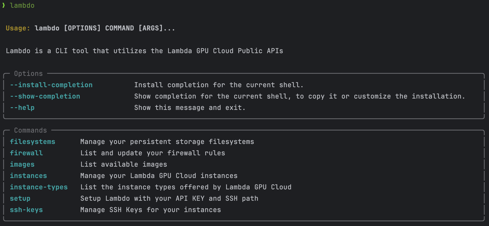

# Lambdo
Lamb*do* is a CLI tool that utilizes the Lambda GPU Cloud Public APIs



## Lambda Labs Cloud API
https://docs.lambdalabs.com/public-cloud/cloud-api/

## Lambda Labs Redoc
https://cloud.lambdalabs.com/api/v1/docs

## How does it work?
Lambdo was built using [Typer](https://typer.tiangolo.com) by tiangolo

All of the features included in this page work out of the box, including command completion. Be sure to install it!

I utilized the `requests` library to handle the API calls and `pydantic` to import environment variables.

## Documentation

**Usage**:

```console
$ lambdo [OPTIONS] COMMAND [ARGS]...
```

**Options**:

* `--install-completion`: Install completion for the current shell.
* `--show-completion`: Show completion for the current shell, to copy it or customize the installation.
* `--help`: Show this message and exit.

**Commands**:

* `filesystems`: List your persistent storage filesystems
* `instances`: Manage your Lambda GPU Cloud instances
* `instance-types`: List the instances types offered by Lambda...
* `setup`: Setup Lambdo with your API KEY and SSH path
* `ssh-keys`: Manage SSH Keys for your instances

## `lambdo filesystems`

List your persistent storage filesystems

**Usage**:

```console
$ lambdo filesystems [OPTIONS] COMMAND [ARGS]...
```

**Options**:

* `--help`: Show this message and exit.

## `lambdo instances`

Manage your Lambda GPU Cloud instances

**Usage**:

```console
$ lambdo instances [OPTIONS] COMMAND [ARGS]...
```

**Options**:

* `--help`: Show this message and exit.

## `lambdo instance-types`

List the instances types offered by Lambda GPU Cloud

**Usage**:

```console
$ lambdo instance-types [OPTIONS] COMMAND [ARGS]...
```

**Options**:

* `--available`: Show only available instance types.
* `--unavailable`: Show only unavailable instance types.
* `--help`: Show this message and exit.

**Commands**:

* `gpu`: Search for a particular GPU by name
* `location`: Search for GPUs by location

### `lambdo instance-types gpu`

Search for a particular GPU by name

**Usage**:

```console
$ lambdo instance-types gpu [OPTIONS]
```

**Options**:

* `-n, --name TEXT`: Provide the name of the gpu  [required]
* `--help`: Show this message and exit.

### `lambdo instance-types location`

Search for GPUs by location

**Usage**:

```console
$ lambdo instance-types location [OPTIONS]
```

**Options**:

* `-n, --name TEXT`: Search by location  [required]
* `--help`: Show this message and exit.

## `lambdo setup`

Setup Lambdo with your API KEY and SSH path

**Usage**:

```console
$ lambdo setup [OPTIONS] COMMAND [ARGS]...
```

**Options**:

* `--api-key TEXT`: [required]
* `--ssh-path TEXT`: [required]
* `--help`: Show this message and exit.

## `lambdo ssh-keys`

Manage SSH Keys for your instances

**Usage**:

```console
$ lambdo ssh-keys [OPTIONS] COMMAND [ARGS]...
```

**Options**:

* `--help`: Show this message and exit.

**Commands**:

* `add`: Add an SSH key
* `delete`: Delete an SSH key

### `lambdo ssh-keys add`

Add an SSH key

**Usage**:

```console
$ lambdo ssh-keys add [OPTIONS]
```

**Options**:

* `-n, --new`: Add a new SSH Key
* `--help`: Show this message and exit.

### `lambdo ssh-keys delete`

Delete an SSH key

**Usage**:

```console
$ lambdo ssh-keys delete [OPTIONS]
```

**Options**:

* `--key TEXT`: The id of the SSH key you want to delete  [required]
* `--help`: Show this message and exit.

